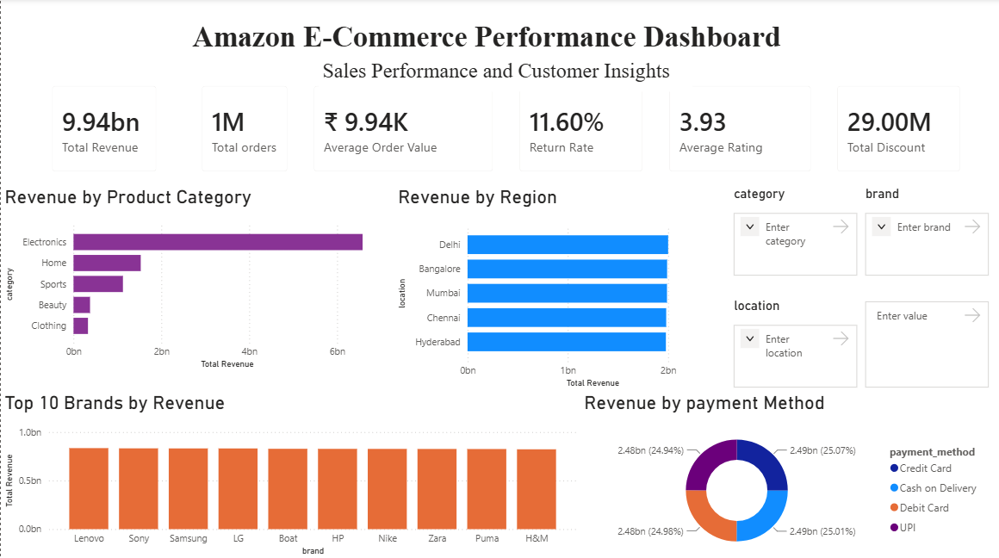
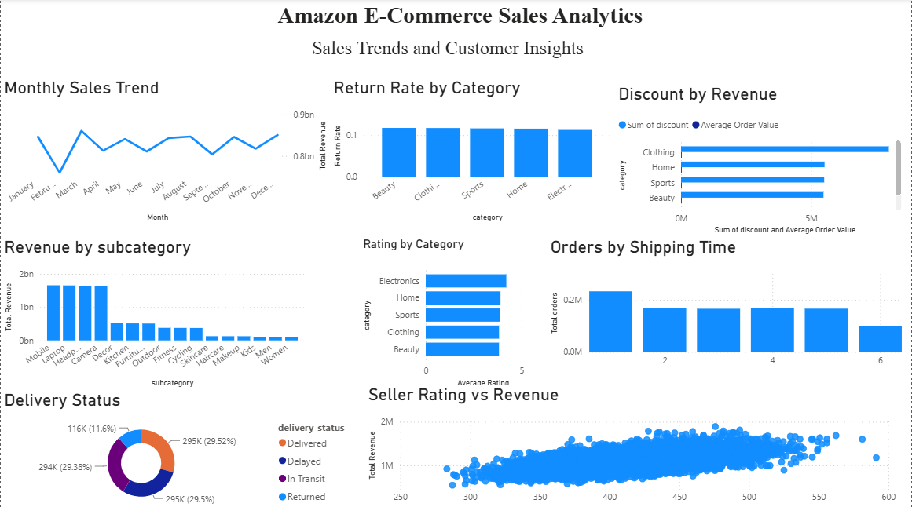

# Amazon E-Commerce Sales Analytics

## Project Overview

This project analyzes Amazon E-Commerce sales data using Python for Exploratory Data Analysis (EDA) and Power BI for interactive dashboard development. The objective is to identify business insights related to sales, customer behavior, product performance, shipping efficiency, discounts, ratings, and returns.

---

## Project Objectives

- Perform Exploratory Data Analysis (EDA)
- Clean and preprocess the dataset
- Identify sales trends and customer behavior
- Analyze product categories and subcategories
- Evaluate discounts and revenue
- Study shipping performance
- Analyze seller ratings
- Build interactive Power BI dashboards

---

## Dataset Information

The original dataset contains 1 million rows and is omitted from this repository due to GitHub file size limits.

- Total Records: 1,000,000
- Total Columns: 20

### Features

- User ID
- Product ID
- Category
- Subcategory
- Brand
- Price
- Discount
- Final Price
- Rating
- Review Count
- Stock
- Seller Rating
- Purchase Date
- Shipping Time
- Payment Method
- Delivery Status
- Return Status
- Location

---

## Tools & Technologies

- Python
- Jupyter Notebook
- Pandas
- NumPy
- Matplotlib
- Seaborn
- Power BI
- Power Query
- Git
- GitHub

---

## Exploratory Data Analysis

The EDA includes:

- Missing Value Analysis
- Duplicate Detection
- Data Type Inspection
- Statistical Summary
- Category Analysis
- Brand Analysis
- Price Distribution
- Rating Analysis
- Shipping Time Analysis
- Discount Analysis
- Revenue Analysis

---

## Dashboard 1

### Amazon Performance Dashboard

Features

- Total Revenue
- Total Orders
- Average Order Value
- Return Rate
- Average Rating
- Total Discount
- Revenue by Category
- Revenue by Brand
- Revenue by Location
- Revenue by Payment Method

---

## Dashboard 2

### Sales Analytics Dashboard

Features

- Monthly Sales Trend
- Revenue by Subcategory
- Return Rate by Category
- Rating by Category
- Orders by Shipping Time
- Discount vs Revenue
- Seller Rating vs Revenue
- Delivery Status Analysis

---

## Key Business Insights

- Electronics generate the highest revenue.
- Home products contribute significantly to sales.
- Monthly sales remain relatively stable throughout the year.
- Higher seller ratings generally lead to increased revenue.
- Discounts influence customer purchasing behavior.
- Delivery status has a noticeable impact on return rates.
- Shipping time affects customer satisfaction.

---

## Repository Structure

```
Amazon-Ecommerce-Sales-Analytics/
│
├── Amazon_Ecommerce_EDA.ipynb
├── Amazon_Ecommerce_Dashboard.pbix
├── requirements.txt
├── README.md
├── Amazon_Dashboard_Page1.png
└── Amazon_Dashboard_Page2.png
```

---

## Dashboard Preview

### Dashboard 1



---

### Dashboard 2



---

## Future Improvements

- Sales Forecasting
- Customer Segmentation
- Product Recommendation System
- Time Series Analysis
- Interactive Filters
- Predictive Analytics

---

## Author

**Venkata Janardhana Chowdary valluri**

- GitHub: https://github.com/venkatajv
- LinkedIn: https://www.linkedin.com/in/venkata-janardhana-chowdary-valluri-74b802242
